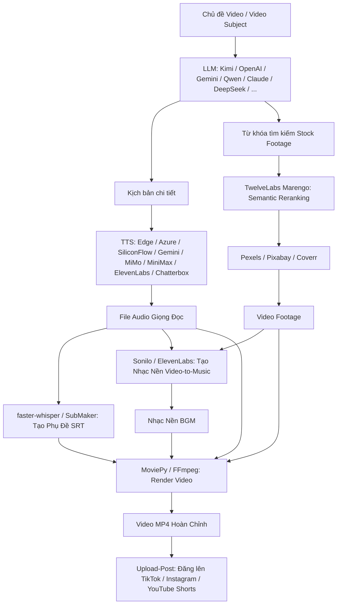

# Danh Sách Toàn Bộ Các API & Dịch Vụ AI Trong Dự Án MoneyPrinterTurbo

Tài liệu này tổng hợp toàn bộ các giao diện lập trình ứng dụng (API), nhà cung cấp mô hình trí tuệ nhân tạo (AI Providers), Text-to-Speech (TTS), AI tạo nhạc, AI thị giác/semantic understanding, và các dịch vụ tích hợp có trong dự án **MoneyPrinterTurbo**.

---

## 📑 Mục lục
1. [Tổng Quan Kiến Trúc AI Trong Dự Án](#1-tổng-quan-kiến-trúc-ai-trong-dự-án)
2. [Nhà Cung Cấp Mô Hình Ngôn Ngữ Lớn (LLM Providers - 21 Dịch Vụ)](#2-nhà-cung-cấp-mô-hình-ngôn-ngữ-lớn-llm-providers)
3. [Dịch Vụ Chuyển Văn Bản Thành Giọng Nói (Text-to-Speech / TTS - 8 Dịch Vụ)](#3-dịch-vụ-chuyển-văn-bản-thành-giọng-nói-text-to-speech--tts)
4. [Dịch Vụ AI Tạo Nhạc Nền Video (AI Music Generation - 2 Dịch Vụ)](#4-dịch-vụ-ai-tạo-nhạc-nền-video-ai-music-generation)
5. [AI Hiểu Video & Xếp Hạng Ngữ Nghĩa (TwelveLabs Semantic AI)](#5-ai-hiểu-video--xếp-hạng-ngữ-nghĩa-twelvelabs-semantic-ai)
6. [AI Nhận Dạng Giọng Nói & Tạo Phụ Đề (Speech-to-Text / STT - Whisper)](#6-ai-nhận-dạng-giọng-nói--tạo-phụ-đề-speech-to-text--stt)
7. [Nền Tảng AI Agent & Tạo Kịch Bản Hàng Loạt (LoomLoom / Shengsuan Cloud)](#7-nền-tảng-ai-agent--tạo-kịch-bản-hàng-loạt-loomloom--shengsuan-cloud)
8. [API Kho Tư Liệu Video Miễn Phí (Stock Footage APIs)](#8-api-kho-tư-liệu-video-miễn-phí-stock-footage-apis)
9. [API Tự Động Đăng Đa Nền Tảng (Cross-platform Publishing)](#9-api-tự-động-đăng-đa-nền-tảng-cross-platform-publishing)
10. [Mẫu Cấu Hình `config.toml` Đầy Đủ](#10-mẫu-cấu-hình-configtoml-đầy-đủ)

---

## 1. Tổng Quan Kiến Trúc AI Trong Dự Án

MoneyPrinterTurbo sử dụng mô hình đa tầng AI kết hợp:
* **LLM (Large Language Model)**: Tạo chủ đề, phân tích nội dung, sinh kịch bản chi tiết theo từng đoạn và trích xuất từ khóa tìm kiếm video (video terms).
* **TTS (Text-to-Speech)**: Tổng hợp giọng đọc lồng tiếng sống động, chính xác theo nhịp kịch bản.
* **TwelveLabs (Multimodal Embedding & QA)**: Dùng mô hình *Marengo* để vector hóa và sắp xếp từ khóa tìm kiếm phù hợp với chủ đề; dùng *Pegasus* để đánh giá kiểm thử (QA) video clip.
* **faster-whisper**: AI trích xuất timestamp và đồng bộ phụ đề chính xác đến từng mili-giây.
* **AI Music**: Tạo nhạc nền nguyên bản khớp nhịp video qua Sonilo hoặc ElevenLabs Music.



---

## 2. Nhà Cung Cấp Mô Hình Ngôn Ngữ Lớn (LLM Providers)

Dự án quản lý tập trung 21 LLM Provider thông qua registry tại `app/models/llm_provider.py` và adapter tại `app/services/llm.py`.

| STT | Provider ID | Tên hiển thị | Model mặc định | Base URL mặc định | Link lấy API Key | Adapter |
| :--- | :--- | :--- | :--- | :--- | :--- | :--- |
| 1 | `moonshot` | **Kimi / Moonshot AI** (Khuyên dùng) | `kimi-k3` | `https://api.moonshot.cn/v1` | [platform.kimi.com](https://platform.kimi.com) | `openai_compatible` |
| 2 | `openai` | **OpenAI** | `gpt-5.5` | `https://api.openai.com/v1` | [platform.openai.com](https://platform.openai.com/api-keys) | `openai_compatible` |
| 3 | `gemini` | **Google Gemini** | `gemini-3.1-pro-preview` | *(Google GenAI SDK)* | [aistudio.google.com](https://aistudio.google.com/app/apikey) | `gemini` |
| 4 | `deepseek` | **DeepSeek** | `deepseek-v4-pro` | `https://api.deepseek.com` | [platform.deepseek.com](https://platform.deepseek.com/api_keys) | `openai_compatible` |
| 5 | `qwen` | **Alibaba Cloud Qwen (DashScope)** | `qwen-max` | *(DashScope SDK)* | [dashscope.console.aliyun.com](https://dashscope.console.aliyun.com/apiKey) | `qwen` |
| 6 | `azure` | **Microsoft Azure OpenAI** | `gpt-35-turbo` | `https://{resource}.openai.azure.com` | [portal.azure.com](https://portal.azure.com) | `azure` |
| 7 | `volcengine` | **ByteDance VolcEngine Ark (火山引擎)** | `doubao-seed-2-1-turbo-260628` | `https://ark.cn-beijing.volces.com/api/v3` | [console.volcengine.com](https://console.volcengine.com/ark) | `openai_compatible` |
| 8 | `grok` | **xAI Grok** | `grok-4.3` | `https://api.x.ai/v1` | [console.x.ai](https://console.x.ai/) | `openai_compatible` |
| 9 | `minimax` | **MiniMax** | `MiniMax-M3` | `https://api.minimax.io/v1` | [platform.minimax.io](https://platform.minimax.io/) | `openai_compatible` |
| 10 | `mimo` | **Xiaomi MiMo (小米)** | `mimo-v2.5-pro` | `https://api.xiaomimimo.com/v1` | [platform.xiaomimimo.com](https://platform.xiaomimimo.com) | `openai_compatible` |
| 11 | `shengsuanyun` | **Shengsuan Cloud (胜算云)** | `deepseek/deepseek-v4-flash` | `https://router.shengsuanyun.com/api/v1` | [shengsuanyun.com](https://www.shengsuanyun.com) | `openai_compatible` |
| 12 | `cloudflare` | **Cloudflare AI Gateway** | `openai/gpt-4.1-mini` | *(Cloudflare Gateway)* | [dash.cloudflare.com](https://dash.cloudflare.com/) | `cloudflare_ai_gateway` |
| 13 | `modelscope` | **Alibaba ModelScope (魔搭)** | `ZhipuAI/GLM-5.2` | `https://api-inference.modelscope.cn/v1/` | [modelscope.cn](https://modelscope.cn) | `modelscope` |
| 14 | `aihubmix` | **AIHubMix** | `gpt-5.4-mini` | `https://aihubmix.com/v1` | [aihubmix.com](https://aihubmix.com/) | `openai_compatible` |
| 15 | `aimlapi` | **AIML API** | `openai/gpt-5-5` | `https://api.aimlapi.com/v1` | [aimlapi.com](https://aimlapi.com/app/keys) | `openai_compatible` |
| 16 | `evolink` | **EvoLink** | `gpt-5.5` | `https://direct.evolink.ai/v1` | [evolink.ai](https://evolink.ai/dashboard/keys) | `openai_compatible` |
| 17 | `ollama` | **Ollama (Mô hình Local)** | Tùy chọn local | `http://127.0.0.1:11434/v1` | *(Local Open Source)* | `openai_compatible` |
| 18 | `oneapi` | **OneAPI / NewAPI** | Tùy chọn channel | URL OneAPI của bạn | *(Tự triển khai / Private)* | `openai_compatible` |
| 19 | `litellm` | **LiteLLM (100+ Providers)** | `openai/gpt-4o-mini` | *(LiteLLM Proxy / SDK)* | [docs.litellm.ai](https://docs.litellm.ai) | `litellm` |
| 20 | `groq` | **Groq (Siêu tốc độ LPU)** | `llama-3.3-70b-versatile` | `https://api.groq.com/openai/v1` | [console.groq.com](https://console.groq.com/keys) | `openai_compatible` |
| 21 | `pollinations` | **Pollinations AI** | `openai-fast` | `https://gen.pollinations.ai/v1` | [enter.pollinations.ai](https://enter.pollinations.ai/) | `openai_compatible` |

### Chi tiết cấu hình tham số cho LLM trong `config.toml` (`[app]` section):
```toml
# Chọn nhà cung cấp: moonshot, openai, gemini, deepseek, qwen, azure, volcengine,
# grok, minimax, mimo, shengsuanyun, cloudflare, modelscope, aihubmix, aimlapi,
# evolink, ollama, oneapi, litellm, groq, pollinations.
llm_provider = "moonshot"

# Cấu hình từng Provider tương ứng:
moonshot_api_key = "sk-..."
moonshot_base_url = "https://api.moonshot.cn/v1"
moonshot_model_name = "kimi-k3"

openai_api_key = "sk-..."
openai_base_url = "https://api.openai.com/v1"
openai_model_name = "gpt-5.5"

gemini_api_key = "AIzaSy..."
gemini_model_name = "gemini-3.1-pro-preview"

deepseek_api_key = "sk-..."
deepseek_base_url = "https://api.deepseek.com"
deepseek_model_name = "deepseek-v4-pro"

qwen_api_key = "sk-..."
qwen_model_name = "qwen-max"

azure_api_key = "..."
azure_base_url = "https://your-resource.openai.azure.com"
azure_model_name = "your-deployment-name"
azure_api_version = "2024-02-15-preview"

cloudflare_api_key = "..."
cloudflare_account_id = "..."
cloudflare_gateway_id = "default"
cloudflare_model_name = "openai/gpt-4.1-mini"
```

---

## 3. Dịch Vụ Chuyển Văn Bản Thành Giọng Nói (Text-to-Speech / TTS)

Hệ thống giọng đọc được cài đặt trong `app/services/voice.py` hỗ trợ 8 nhà cung cấp khác nhau:

### 1. Microsoft Edge TTS (`edge-tts`)
* **Đặc điểm**: Miễn phí 100%, tích hợp sẵn, hỗ trợ hàng trăm giọng đọc đa ngôn ngữ (bao gồm tiếng Việt `vi-VN-HoaiMyNeural`, `vi-VN-NamMinhNeural`, tiếng Anh, tiếng Trung,...).
* **Tính năng**: Tự động sinh `SubMaker` cue time để tạo phụ đề chính xác.
* **Cấu hình**:
  ```toml
  [app]
  edge_tts_timeout = 30 # Thời gian timeout cho mỗi stream request (giây)
  ```

### 2. Azure Speech Services TTS (`[azure]`)
* **Endpoint / SDK**: Microsoft Cognitive Services Speech SDK.
* **Giọng đọc**: Giọng đọc chất lượng cao tự nhiên của Microsoft Azure, hỗ trợ định dạng SSML (Speech Synthesis Markup Language) v1 và v2.
* **Cấu hình**:
  ```toml
  [azure]
  speech_key = "your-azure-speech-key"
  speech_region = "eastus" # hoặc khu vực của tài nguyên Azure
  ```

### 3. SiliconFlow TTS (`[siliconflow]`)
* **Đơn vị cung cấp**: [SiliconFlow](https://siliconflow.cn/)
* **Mô hình cốt lõi**: `FunAudioLLM/CosyVoice2-0.5B` (CosyVoice 2.0)
* **Danh sách giọng mẫu**: `alex`, `anna`, `bella`, `benjamin`, `charles`, `claire`, `david`, `diana`.
* **Cấu hình**:
  ```toml
  [siliconflow]
  api_key = "sk-..."
  ```

### 4. Google Gemini TTS
* **Mô hình**: Tích hợp trực tiếp qua Gemini API Audio output.
* **Giọng đọc**: Hỗ trợ các profile giọng đọc như `Puck`, `Charon`, `Kore`, `Fenrir`, `Aoede`.
* **Cấu hình**: Dùng chung `gemini_api_key` trong `[app]`.

### 5. Xiaomi MiMo TTS (小米)
* **Model ID**: `mimo-v2.5-tts`
* **Tính năng độc quyền**: `mimo_tts_style_prompt` - Điều chỉnh phong cách giọng đọc bằng prompt tự nhiên.
* **Cấu hình**:
  ```toml
  [app]
  mimo_api_key = "your-mimo-key"
  mimo_base_url = "https://api.xiaomimimo.com/v1"
  mimo_tts_model_name = "mimo-v2.5-tts"
  mimo_tts_style_prompt = "请用自然、清晰、适合短视频旁白的语气朗读。"
  ```

### 6. MiniMax TTS (`[minimax_tts]`)
* **Endpoint Quốc tế**: `https://api.minimax.io/v1/t2a_v2`
* **Endpoint Nội địa TQ**: `https://api.minimaxi.com/v1/t2a_v2`
* **Danh sách Model**: `speech-2.8-hd`, `speech-2.8-turbo`, `speech-2.6-hd`, `speech-2.6-turbo`, `speech-02-hd`, `speech-02-turbo`, `speech-01-hd`, `speech-01-turbo`.
* **Cấu hình**:
  ```toml
  [minimax_tts]
  api_key = "your-minimax-api-key"
  base_url = "https://api.minimax.io/v1/t2a_v2"
  model_id = "speech-2.8-hd"
  voice_id = "English_expressive_narrator"
  sample_rate = 32000
  bitrate = 128000
  audio_format = "mp3"
  channel = 1
  pitch = 0
  ```

### 7. ElevenLabs TTS (`[elevenlabs]`)
* **Nhà cung cấp**: [ElevenLabs](https://elevenlabs.io/)
* **Model ID**: `eleven_multilingual_v2`, `eleven_flash_v2_5`, `eleven_v3`.
* **Tính năng**: Tự động load danh sách Favorite Voices từ tài khoản ElevenLabs của người dùng.
* **Cấu hình**:
  ```toml
  [elevenlabs]
  api_key = "your-elevenlabs-api-key"
  model_id = "eleven_multilingual_v2"
  ```

### 8. Chatterbox TTS (`[chatterbox]`)
* **Đặc điểm**: Tương thích giao thức OpenAI Audio Speech API cho các server TTS tự host (ví dụ `travisvn/chatterbox-tts-api` chạy local qua Docker).
* **Cấu hình**:
  ```toml
  [chatterbox]
  base_url = "http://127.0.0.1:4123/v1"
  api_key = ""
  model_id = "chatterbox"
  voices = ["default-Female", "default-Male"]
  ```

---

## 4. Dịch Vụ AI Tạo Nhạc Nền Video (AI Music Generation)

Hỗ trợ 2 giải pháp AI chuyển video thành nhạc nền (Video-to-Music):

### 1. Sonilo AI Music (`app/services/sonilo.py`)
* **Endpoint**: `https://api.sonilo.com/v1/video-to-music`
* **Link Console**: [platform.sonilo.com/dashboard](https://platform.sonilo.com/dashboard)
* **Tính năng**: Tự động phân tích tiết tấu, cảm xúc và hình ảnh video để sinh ra bản nhạc nền khớp nhịp (Video-matched original BGM).
* **Cấu hình**:
  ```toml
  [app]
  sonilo_api_key = "sonilo_live_..."
  sonilo_base_url = "https://api.sonilo.com"
  sonilo_timeout = 600 # Thời gian timeout tối đa cho stream
  ```

### 2. ElevenLabs AI Music (`app/services/elevenlabs_music.py`)
* **Endpoint**: `https://api.elevenlabs.io/v1/music/video-to-music`
* **Model hỗ trợ**: `music_v2` (mặc định), `music_v1`
* **Tính năng**: Sử dụng video mô tả và prompt để sinh bản nhạc nền AI chất lượng studio.
* **Cấu hình**:
  ```toml
  [elevenlabs]
  api_key = "your-elevenlabs-api-key"
  music_model_id = "music_v2"
  music_timeout = 600
  ```

---

## 5. AI Hiểu Video & Xếp Hạng Ngữ Nghĩa (TwelveLabs Semantic AI)

Tích hợp tại `app/services/twelvelabs.py` ([twelvelabs.io](https://twelvelabs.io)):

* **Mô hình Marengo (`marengo3.0`) - Multimodal Embeddings**:
  - Tạo vector embedding 512 chiều cho chủ đề video và các từ khóa tìm kiếm.
  - Tính toán độ tương đồng Cosine để tự động **Rerank** (sắp xếp lại) danh sách từ khóa tìm kiếm video, đảm bảo những cảnh quan trọng và sát nghĩa nhất sẽ được tải và đưa vào timeline trước.
* **Mô hình Pegasus (`pegasus1.5`) - Video Understanding & QA**:
  - Kiểm tra chất lượng clip từ URL công khai, mô tả hành động trong clip và xác nhận hình ảnh có khớp với kịch bản hay không trước khi render.
* **Cấu hình**:
  ```toml
  [app]
  twelvelabs_api_keys = ["tlk_your_key_here"] # Hỗ trợ xoay vòng nhiều key
  twelvelabs_rerank_terms = true               # Bật tính năng rerank bằng AI
  twelvelabs_marengo_model = "marengo3.0"
  twelvelabs_pegasus_model = "pegasus1.5"
  ```

---

## 6. AI Nhận Dạng Giọng Nói & Tạo Phụ Đề (Speech-to-Text / STT)

Tích hợp tại `app/services/subtitle.py` và `app/services/voice.py`:

* **faster-whisper (Mô hình Whisper của OpenAI chạy bằng CTranslate2)**:
  - Nhận diện giọng nói offline cục bộ siêu tốc, hỗ trợ tăng tốc phần cứng qua CUDA (GPU NVIDIA) hoặc tối ưu hóa trên CPU.
  - Tự động download mô hình trong lần chạy đầu tiên.
  - Cắt timestamp phụ đề chuẩn xác từng từ/câu.
* **Cấu hình**:
  ```toml
  [app]
  subtitle_provider = "edge" # "edge" hoặc "whisper"

  [whisper]
  model_size = "large-v3"   # tiny, base, small, medium, large-v3
  device = "cpu"            # "cpu" hoặc "cuda"
  compute_type = "int8"     # CPU: "int8" | CUDA: "float16", "int8_float16"
  initial_prompt = ""       # Prompt gợi ý từ vựng chuyên ngành
  ```

---

## 7. Nền Tảng AI Agent & Tạo Kịch Bản Hàng Loạt (LoomLoom / Shengsuan Cloud)

Tích hợp tại `app/services/loomloom.py`:

* **Endpoint**: `https://loomloom.shengsuanyun.com/loom/v1`
* **Bản chất**: Kết nối tới MoneyPrinterTurbo SkillBot trên chợ bot Shengsuan Cloud.
* **Tính năng**:
  - Cho phép người dùng sinh hàng loạt ứng viên kịch bản (Script Candidates) độc lập.
  - Xem trước báo giá token (Quote) trước khi thực hiện thanh toán và chạy sinh hàng loạt.
  - Tích hợp trực tiếp trên giao diện WebUI.
* **Cấu hình**:
  ```toml
  [app]
  script_generation_backend = "local" # "local" hoặc "loomloom"
  loomloom_base_url = "https://loomloom.shengsuanyun.com/loom/v1"
  loomloom_api_token = "your-loomloom-token"
  loomloom_request_timeout_seconds = 30
  loomloom_poll_interval_seconds = 2
  loomloom_run_timeout_seconds = 600
  loomloom_video_run_timeout_seconds = 1800
  ```

---

## 8. API Kho Tư Liệu Video Miễn Phí (Stock Footage APIs)

Tích hợp tại `app/services/material.py` để tự động tìm kiếm video footage khớp với kịch bản:

| Dịch vụ | Nguồn đăng ký | Kiểu API | Đặc điểm |
| :--- | :--- | :--- | :--- |
| **Pexels Video API** | [pexels.com/api](https://www.pexels.com/api/) | REST API (API Key) | Kho video dọc/ngang HD & 4K phong phú |
| **Pixabay Video API** | [pixabay.com/api/docs](https://pixabay.com/api/docs/) | REST API (API Key) | Đa dạng chủ đề, hỗ trợ lọc kích thước |
| **Coverr Video API** | [coverr.co/developers](https://coverr.co/developers) | REST API (API Key) | Cảnh quay B-roll điện ảnh chất lượng cao |

* **Cấu hình**:
  ```toml
  [app]
  video_source = "pexels" # "pexels", "pixabay", "coverr", "loomloom", "local"
  pexels_api_keys = ["key-1", "key-2"]   # Hỗ trợ xoay vòng nhiều key
  pixabay_api_keys = ["key-1"]
  coverr_api_keys = ["key-1"]
  match_materials_to_script = false      # Ghép video theo đúng thứ tự kịch bản
  ```

---

## 9. API Tự Động Đăng Đa Nền Tảng (Cross-platform Publishing)

Tích hợp tại `app/services/upload_post.py` qua dịch vụ **Upload-Post API** ([upload-post.com](https://upload-post.com/)):

* **Nền tảng hỗ trợ**: **TikTok**, **Instagram Reels**, **YouTube Shorts**.
* **Tính năng**: Tự động đăng tải video hoàn chỉnh lên các mạng xã hội ngay sau khi render xong.
* **Cấu hình**:
  ```toml
  [app]
  upload_post_enabled = false
  upload_post_api_key = "your-upload-post-api-key"
  upload_post_username = "your-username"
  upload_post_platforms = ["tiktok", "instagram", "youtube"]
  upload_post_auto_upload = false
  upload_post_youtube_privacy_status = "public" # public, unlisted, private
  upload_post_max_pending_tasks = 10
  ```

---

## 10. Mẫu Cấu Hình `config.toml` Đầy Đủ

Dưới đây là file mẫu tổng hợp để bạn thiết lập nhanh toàn bộ các API trong dự án:

```toml
# =============================================================================
# Cấu hình API Server
# =============================================================================
log_level = "DEBUG"
listen_host = "0.0.0.0"
listen_port = 8080

[app]
# 1. LLM Provider
llm_provider = "moonshot"

# Kimi / Moonshot AI
moonshot_api_key = ""
moonshot_base_url = ""
moonshot_model_name = ""

# OpenAI
openai_api_key = ""
openai_base_url = ""
openai_model_name = ""

# Google Gemini
gemini_api_key = ""
gemini_model_name = ""

# DeepSeek
deepseek_api_key = ""
deepseek_base_url = ""
deepseek_model_name = ""

# Alibaba Cloud Qwen
qwen_api_key = ""
qwen_model_name = ""

# Xiaomi MiMo (LLM & TTS)
mimo_api_key = ""
mimo_base_url = ""
mimo_model_name = ""
mimo_tts_model_name = "mimo-v2.5-tts"
mimo_tts_style_prompt = "请用自然、清晰、适合短视频旁白的语气朗读。"

# 2. Kho Stock Footage
video_source = "pexels"
pexels_api_keys = []
pixabay_api_keys = []
coverr_api_keys = []

# 3. TwelveLabs AI Reranking
twelvelabs_api_keys = []
twelvelabs_rerank_terms = false

# 4. Sonilo AI Music
sonilo_api_key = ""
sonilo_base_url = "https://api.sonilo.com"

# 5. Phụ đề & Video
subtitle_provider = "edge"
edge_tts_timeout = 30
tls_verify = true

# 6. Đăng tự động mạng xã hội
upload_post_enabled = false
upload_post_api_key = ""
upload_post_username = ""
upload_post_platforms = ["tiktok", "instagram"]

# =============================================================================
# Cấu hình TTS Providers
# =============================================================================
[azure]
speech_key = ""
speech_region = ""

[siliconflow]
api_key = ""

[minimax_tts]
api_key = ""
base_url = ""
model_id = "speech-2.8-hd"
voice_id = "English_expressive_narrator"

[elevenlabs]
api_key = ""
model_id = "eleven_multilingual_v2"
music_model_id = "music_v2"

[chatterbox]
base_url = "http://127.0.0.1:4123/v1"
api_key = ""
model_id = "chatterbox"
voices = ["default-Female"]

# =============================================================================
# Cấu hình Whisper Subtitles
# =============================================================================
[whisper]
model_size = "large-v3"
device = "cpu"
compute_type = "int8"
```
